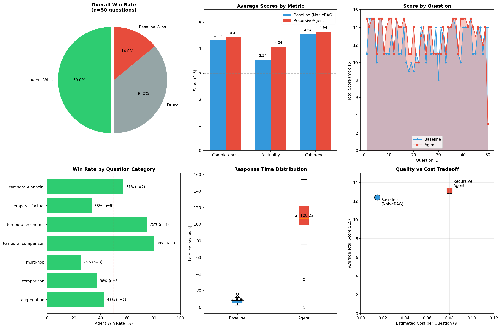

# Recursive Deep Research Agent

<p align="center">
  <strong>An Inference-Time Compute Engine for Complex, Open-Ended Research</strong>
</p>

<p align="center">
  <a href="#features">Features</a> •
  <a href="#results">Results</a> •
  <a href="#architecture">Architecture</a> •
  <a href="#installation">Installation</a> •
  <a href="#usage">Usage</a> •
  <a href="#evaluation">Evaluation</a> •
  <a href="#project-structure">Project Structure</a>
</p>

---

## Overview

The **Recursive Deep Research Agent** is an advanced AI system that tackles complex, multi-faceted research questions by decomposing them into structured sub-queries, executing parallel searches, and iteratively refining answers through self-critique. Unlike traditional single-shot RAG systems, this agent employs **inference-time compute** to dynamically expand its reasoning until the answer is sufficiently comprehensive.

### Key Insight

Most research questions aren't answerable with a single search. They require:
- **Multi-hop reasoning**: Chaining facts across multiple sources
- **Temporal awareness**: Understanding when events occurred relative to each other
- **Aggregation**: Combining data points from disparate sources
- **Self-verification**: Checking if the answer actually addresses the question

This agent handles all of these automatically.

---

## Features

- **DAG-Based Query Decomposition**: Complex queries are broken into a Directed Acyclic Graph of sub-questions with explicit dependencies
- **Parallel Execution**: Independent sub-queries execute concurrently for optimal performance
- **Self-Correction Loop**: A "Critic" agent evaluates answer completeness and spawns additional research when needed
- **Checkpoint Support**: Long-running evaluations can be paused and resumed
- **A/B Testing Framework**: Built-in comparison against a Naive RAG baseline with LLM-as-a-Judge scoring
- **50-Question Golden Set**: Curated benchmark of hard compositional questions across 7 categories

---

## Results

We evaluated the Recursive Deep Research Agent against a **NaiveRAG baseline** (single-shot search + answer) on our 50-question golden set using **GPT-4o as a judge**.

<p align="center">
  
</p>

### Key Findings

| Metric | RecursiveAgent | NaiveRAG Baseline | Improvement |
|--------|---------------|-------------------|-------------|
| **Completeness** | 4.42/5 | 4.30/5 | +2.8% |
| **Factuality** | 4.04/5 | 3.54/5 | **+14.1%** |
| **Coherence** | 4.64/5 | 4.54/5 | +2.2% |
| **Total Score** | 13.10/15 | 12.38/15 | +5.8% |
| **Perfect Scores (5/5/5)** | 30% | 16% | **+87.5%** |

### Head-to-Head Performance

```
┌─────────────────────────────────────────┐
│         Win Rate (n=50 questions)       │
├─────────────────────────────────────────┤
│  Agent Wins:    25 (50.0%)  ████████░░  │
│  Draws:         18 (36.0%)  ███████░░░  │
│  Baseline Wins:  7 (14.0%)  ███░░░░░░░  │
└─────────────────────────────────────────┘
```

### Performance by Question Category

The agent shows **strongest performance** on questions requiring temporal reasoning:

| Category | Agent Win Rate | Questions |
|----------|---------------|-----------|
| Temporal Comparison | **80%** | 10 |
| Temporal Economic | **75%** | 4 |
| Temporal Financial | **57%** | 7 |
| Aggregation | 43% | 7 |
| Comparison | 38% | 8 |
| Temporal Factual | 33% | 6 |
| Multi-hop | 25% | 8 |

### Quality vs. Cost Tradeoff

| System | Avg. Latency | Est. Cost/Question | Quality Score |
|--------|--------------|-------------------|---------------|
| NaiveRAG | **6.8s** | ~$0.01 | 12.38/15 |
| RecursiveAgent | 108.2s | ~$0.10 | **13.10/15** |

**Insight**: The RecursiveAgent invests ~16x more compute time to achieve meaningfully higher factuality (+14%) and nearly **double the rate of perfect answers** (30% vs 16%). This tradeoff is valuable for high-stakes research questions where accuracy matters more than speed.

---

## Architecture

```
┌─────────────────────────────────────────────────────────────────┐
│                        USER QUERY                                │
└─────────────────────────────────────────────────────────────────┘
                              │
                              ▼
┌─────────────────────────────────────────────────────────────────┐
│                    PLANNER (Claude Sonnet)                       │
│         Decomposes query into DAG of sub-questions               │
└─────────────────────────────────────────────────────────────────┘
                              │
                              ▼
┌─────────────────────────────────────────────────────────────────┐
│                   EXECUTOR (Parallel)                            │
│    ┌──────────┐  ┌──────────┐  ┌──────────┐                     │
│    │ Search 1 │  │ Search 2 │  │ Search 3 │  ... (Tavily API)   │
│    └────┬─────┘  └────┬─────┘  └────┬─────┘                     │
│         │             │             │                            │
│         ▼             ▼             ▼                            │
│    ┌──────────┐  ┌──────────┐  ┌──────────┐                     │
│    │Worker LLM│  │Worker LLM│  │Worker LLM│  (GPT-4o-mini)      │
│    └──────────┘  └──────────┘  └──────────┘                     │
└─────────────────────────────────────────────────────────────────┘
                              │
                              ▼
┌─────────────────────────────────────────────────────────────────┐
│                 AGGREGATOR (Claude Sonnet)                       │
│              Synthesizes findings into answer                    │
└─────────────────────────────────────────────────────────────────┘
                              │
                              ▼
┌─────────────────────────────────────────────────────────────────┐
│                   CRITIC (Claude Sonnet)                         │
│           Evaluates completeness, identifies gaps                │
│                                                                  │
│    ┌─────────────┐          ┌──────────────────┐                │
│    │ Sufficient? │───YES───▶│   FINAL ANSWER   │                │
│    └──────┬──────┘          └──────────────────┘                │
│           │ NO                                                   │
│           ▼                                                      │
│    ┌─────────────────┐                                          │
│    │ Generate new    │──────────────┐                           │
│    │ sub-questions   │              │                           │
│    └─────────────────┘              │                           │
└─────────────────────────────────────┼───────────────────────────┘
                                      │
                                      ▼
                            (Back to EXECUTOR)
```

### Model Configuration

| Role | Model | Purpose |
|------|-------|---------|
| **Planner** | Claude Sonnet 4 | Query decomposition & DAG generation |
| **Critic** | Claude Sonnet 4 | Answer evaluation & gap identification |
| **Worker** | GPT-4o-mini | Search result summarization (cost-efficient) |
| **Judge** | GPT-4o | A/B test evaluation (high accuracy) |
| **Search** | Tavily API | Real-time web search |

---

## Installation

### Prerequisites

- Python 3.10+
- API keys for: Anthropic, OpenAI, and Tavily

### Quick Start

```bash
# Clone the repository
git clone https://github.com/yourusername/Recursive-Deep-Research.git
cd Recursive-Deep-Research

# Setup virtual environment and install dependencies
make setup

# Configure your API keys
cp .env.example .env
# Edit .env with your actual API keys

# Run a test query
make inference
```

### Manual Installation

```bash
python3.10 -m venv venv
source venv/bin/activate
pip install -r requirements.txt
pip install -e .
```

---

## Usage

### Single Query Inference

```bash
# Run with default test query
make inference

# Run with custom query
make inference-custom
# Then enter your query when prompted
```

### Programmatic Usage

```python
from src.model import RecursiveAgent
from src.config_parser import ConfigParser

config = ConfigParser().get_config()
agent = RecursiveAgent(config)

inputs = {
    "original_query": "What is the age difference between the CEOs of Apple and Microsoft as of 2024?",
    "plan": [],
    "results": {},
    "critique_count": 0,
    "messages": [],
    "draft_answer": ""
}

# Stream the agent's thinking process
for event in agent.graph.stream(inputs):
    for node, value in event.items():
        print(f"[{node}] {value.get('messages', [''])[0]}")

# Get final answer from accumulated state
```

### Google Colab

Open `Recursive_Deep_Research_Colab_V2.ipynb` in Google Colab for an interactive notebook experience with:
- Step-by-step execution
- Visual configuration widgets
- Built-in evaluation harness
- Result visualization

---

## Evaluation

### Golden Set Benchmark

The project includes a curated set of 50 hard compositional questions across 7 categories:

| Category | Count | Example |
|----------|-------|---------|
| **Multi-hop** | 8 | "What is the age difference between the directors of the two highest-grossing films of 1994?" |
| **Temporal Comparison** | 10 | "Which AI model was released first: Claude 2 or GPT-4, and by how many days?" |
| **Temporal Financial** | 7 | "What was the stock price change of Boeing in the week following each of the two 737 MAX crashes?" |
| **Aggregation** | 7 | "How many combined Grammy Awards have Taylor Swift and Beyonce won as of 2024?" |
| **Temporal Factual** | 6 | "What was the unemployment rate in the US on the day Biden was inaugurated vs Trump?" |
| **Temporal Economic** | 4 | "Compare the housing price index change in the US during the 2008 crisis vs the 2020-2022 boom." |
| **Comparison** | 8 | "Which company spends more on R&D annually: Apple or Alphabet?" |

### Running Evaluation

```bash
# Run full A/B evaluation (RecursiveAgent vs NaiveRAG)
make evaluate

# Results are saved to checkpoints/eval_report_TIMESTAMP.json
```

### Evaluation Metrics

The evaluation uses **LLM-as-a-Judge** (GPT-4o) to score answers on:

- **Completeness** (1-5): Did it answer ALL parts of the question?
- **Factuality** (1-5): Are claims specific, verifiable, and grounded?
- **Coherence** (1-5): Is the answer well-structured and clear?

### Checkpoint Support

Long evaluations can be interrupted and resumed:

```python
evaluator = Evaluator(config)
evaluator.train(resume=True)  # Automatically resumes from last checkpoint
```

---

## Project Structure

```
Recursive-Deep-Research/
├── src/
│   ├── model.py          # RecursiveAgent - main agent implementation
│   ├── schemas.py        # Pydantic models (SubQuery, Assessment, JudgeScore)
│   ├── trainer.py        # Evaluator, NaiveRAG baseline, metrics
│   ├── dataset.py        # ResearchDataset loader
│   ├── config_parser.py  # YAML config parser with CLI overrides
│   └── utils.py          # Logging, seeding, artifact saving
├── scripts/
│   ├── inference.py      # Single query inference script
│   ├── evaluate.py       # Full evaluation harness
│   └── train.py          # Training entry point (runs evaluation)
├── configs/
│   └── default.yaml      # Default configuration
├── data/
│   └── golden_set.json   # 50-question evaluation benchmark
├── checkpoints/          # Evaluation checkpoints & reports
├── logs/                 # Execution logs
├── Makefile              # Common commands
├── requirements.txt      # Python dependencies
└── .env.example          # API key template
```

---

## Configuration

Edit `configs/default.yaml` to customize:

```yaml
experiment_name: "recursive_agent_v1"
seed: 42

models:
  planner: "claude-sonnet-4-20250514"  # Query decomposition
  critic: "claude-sonnet-4-20250514"   # Answer evaluation
  worker: "gpt-4o-mini"                # Search summarization
  judge: "gpt-4o"                      # A/B evaluation

agent:
  max_loops: 3              # Maximum critique-refine iterations
  search_max_results: 5     # Tavily results per query

paths:
  data_path: "data/golden_set.json"
  log_dir: "logs/"
  checkpoint_dir: "checkpoints/"
```

---

## How It Works

### 1. Query Decomposition

The Planner receives a complex query and outputs a **dependency graph** of sub-questions:

```
Query: "Compare the time from founding to IPO for Uber vs Lyft"

Generated Plan:
├── [1] When was Uber founded? (deps: [])
├── [2] When was Lyft founded? (deps: [])
├── [3] When did Uber IPO? (deps: [])
├── [4] When did Lyft IPO? (deps: [])
└── [5] Calculate and compare the durations (deps: [1,2,3,4])
```

### 2. Parallel Execution

Steps 1-4 have no dependencies and execute **in parallel**. Step 5 waits for all dependencies to complete.

### 3. Self-Critique Loop

After aggregation, the Critic evaluates:
- Does this answer ALL parts of the original question?
- Are there any factual gaps?
- Is it specific enough with concrete data?

If insufficient, new sub-questions are generated and the cycle repeats (up to `max_loops`).

---

## Cost Estimation

| System | Est. Cost per Question | Avg. Latency |
|--------|------------------------|--------------|
| NaiveRAG (baseline) | ~$0.01-0.02 | ~5 seconds |
| RecursiveAgent | ~$0.08-0.15 | ~30 seconds |

The increased cost reflects the multi-step reasoning and higher-quality answers.

---

## Available Commands

```bash
make setup       # Create venv and install all dependencies
make install     # Install dependencies only
make inference   # Run single query inference
make evaluate    # Run full evaluation on golden set
make clean       # Clean cache and logs
make format      # Format code with black and isort
make help        # Show all available commands
```

---

## Contributing

Contributions are welcome! Areas of interest:

- Additional question categories for the golden set
- Support for more search providers
- Caching layer for repeated queries
- Streaming output support
- Cost optimization strategies

---

## License

MIT License - see [LICENSE](LICENSE) for details.

---

## Acknowledgments

Built with:
- [LangGraph](https://github.com/langchain-ai/langgraph) - Agent orchestration
- [LangChain](https://github.com/langchain-ai/langchain) - LLM integrations
- [Tavily](https://tavily.com/) - Web search API
- [Anthropic Claude](https://www.anthropic.com/) - Planning & critique
- [OpenAI GPT](https://openai.com/) - Worker & judge models
